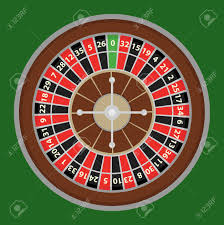

```{r,setup, include=FALSE}
knitr::opts_chunk$set(cache=TRUE)
```

## About

Lecturer-in-charge: Dr Thiyanga S. Talagala

Pre-requisites: 

- Probability and Distribution Theory I

- Probability and Distribution Theory II,

- Programming and Data Analysis with R

Course objective:

The objective of this course is to introduce models for basic stochastic processes,
in particular Markov processes.

Workload: 100 hours

## About (cont.)

Method of Assessment:

• Assignment/ Mid-course-unit examination: 40%
• End-course-unit examination: 60%

Contact:

Discussion forum LMS, Online help desk, Emails, Zoom

Recommended Reading:

Introduction to probability models. Sheldon M. Ross.


## Course content

1. Introduction to Stochastic Processes

2. Discrete Parameter Markov Chains

3. Continuous Parameter Markov Chains


## Recap: Random experiment

A **random experiment** is a physical situation whose outcome cannot be predicted with certainty until it is observed. A random experiment can be repeated as many times as we want under the same conditions (leading to different outcomes). Each one of them a trial. Thus, a trial is a particular performance of a random experiment.

What about this?

```{r, comment=NA, message=FALSE, warning=FALSE, echo=FALSE, fig.height=3}
library(tidyverse)
df <- data.frame(x=1:10, y=rep(c(1,0),5))
ggplot(df, aes(x=factor(x), y=y)) + geom_point()  +  geom_line() + scale_x_discrete(name = 'x')
```

## Sample space

A set of all possible outcomes of a random experiment. Here, I use $\Omega$ to denote a sample space. 

*Example 1:*

*Random Experiment: Tossing of a coin*. 

*Sample Space:* $\Omega = \{H, T\}$

*Example 2:*

*Random Experiment: Toss a coin three times*. 

*Sample Space:* 

$\Omega = \{(H, H, H), (H, H, T), (H, T, H), (T, H, H), (H, T, T), (T, H, T),$

$(T, T, H), (T, T, T)\}$

## Random variable

Let $(\Omega, \mathscr{F}, \mathbb{P})$ be a probability space. Random variable is a function $X: \Omega \rightarrow \mathbb{R}$ such that $\forall B \in \mathcal{B}(
\mathbb{R}
): X^{-1}(B) \in \mathscr{F}$.

**Random variable** is a function from the sample space to the real numbers.  There are two types of random variables: 

i) Discrete random variable 

ii) Continuous random variable

We use Roman capital letters to denote random variables ($X$, $Y$, $Z$, $U$, $T$, etc.). However, as soon as a variable $X$ is observed, the observed values are represented by the corresponding simple Roman letter. 

## What does Stochastic mean?

Origin: Greek


Stochastic refers to a variable process where the outcome involves some **randomness** and has some **uncertainty**. It is a mathematical term and is closely related to “randomness” and “probabilistic” and can be contrasted to the idea of “deterministic.”^[https://machinelearningmastery.com/stochastic-in-machine-learning/]

## Introduction: Stochastic process

Stochastic process is a collection of random variables ordered by an index set.


**Example 1:**

Random variables $X_0, X_1, X_2, ...$ form a stochastic process ordered by the **discrete index set** $\{0, 1, 2,...\}$.

Notation: $\{X_t: t=0, 1, 2, ...\}$.

**Example 2**

$\{X(t): t \geq 0\}$

The indices t are often referred to as "time".

The index set of a stochastic process is always **infinite**.

## In-class


## Definition: Stochastic process

A stochastic process is a collection of random variables $\{X_t; t\in T\}$ or $\{X(t); t\in T\}$
where $T$ is an index set. That is for each $t \in T$ , $X_t$ (or $X(t)$) is a random variable.

## Random variable: Probability Theory vs Stochastic Theory

#### Probability theory

Let $(\Omega, \mathscr{F}, \mathbb{P})$ be a probability space. Random variable is a function $X: \Omega \rightarrow \mathbb{R}$.


#### Stochastic theory

Suppose that $(\Omega, \mathscr{F}, \mathbb{P})$ is a probability space, the function $X: T \times \Omega \rightarrow \mathbb{R}$ .

- We will always assume that the cardinality of $T$ is infinite, either countable or
uncountable.

If $T=\mathbb{Z}^+$ then we called X a discrete time stochastic process.

If $I = [0,\infty)$,
then $X$ is said to be a continuous time stochastic processes.

## Applications

- Population dynamics

- Specification

- Genome evolution

- Statistical pattern of arrivals/ waiting-line analysis or queueing problem of operations research

- Service mechanism describes when service is available, how many customers can be served at a time, and how long service takes

- Applications to risk theory, insurance, actuarial science and system risk engineering

## Example 1

Suppose that a virus can exist in 4 different strains (species), numbered from 1 to 4. In each new generation it either stays the same, or with probability $\alpha$ mutates to another strain,  chosen at random. The $\alpha$ is $0 < \alpha < 1$.

Explain  how to compute the probability that the strain in the fifth generation is the same as the initial strain?

## Example 2

The weather changes at a tourist resort from one day to the next can somewhat simplified be described as a Markov chain with the three states: Sunny, Cloudy and Rainy. Using the weather statistics of the area the following transition probability matrix has been estimated.

$$P = \left[\begin{array}{cccc}
 & S & C & R\\
S & 0.5 & 0.3 & 0.2\\
C & 0.3 & 0.5 & 0.2\\
R & 0.6 & 0.1 & 0.3
\end{array}\right]$$
A tourist intends to visit the resort during 24 - 26 October. What is the probability that there will be three sunny days in a row?

## Example 3

Individuals arrive to a COVID-19 vaccination centre according to a nonhomogeneous Poisson process having the rate function
	\begin{equation*}
\lambda(t) = \begin{cases}
2t & \text{ for } 0 \leq t < 1, \\
2 & \text{ for } 1 \leq t < 2, \\
4-t & \text{ for } 2 \leq t < 4, \\
\end{cases}
\end{equation*}
where $t$ is measured in hours from 8.00am.

Calculate the probability that two people arrive from 8.00am to 10.00am?

## Parameter space and State space

**Parameter space**

$T$ is called the parameter space.

**State space**

The set of possible values of an individual random variable $X_t$ or $X(t)$ can take is called the state space of the process.

## Classification of parameter space

**Discrete-parameter space**

When $T$ is a countable set, the process is said to be a discrete-parameter process. A discrete parameter
stochastic process is denoted by $\{X_t; t \in T\}$.

**Continuous-parameter space**

When $T$ is an interval of the real line, the process is said to be a continuous-parameter process. A continuous-parameter stochastic process is denoted by $\{X(t); t \in T \}$.


## Classification of parameter space

**Discrete-parameter space**

- Observe the values of the Dow-Jones Index at the end of the $n^{th}$ week.

**Continuous-parameter space**

- The number of students waiting for a bus
at any time of day.

## Classification of state space

The state space is discrete if it contains a finite or countably infinite number of points.
Otherwise it is continuous.

### Discrete state space stochastic  processes

- $\{X_n:, n=0, 1, 2, ...\}$,  where the state space of $X_n$ is $\{0, 1, 2\}$
representing which of three types of transactions a person submits to an on-line database service, and time $n$ corresponds to the number of transactions submitted.

- Consider the size of a population at a given time.


### Continuous state space stochastic processes

- Air temperature at a certain place at time t


- Consider the values of the Dow-Jones Index at the end of the $n^{th}$ week

## Classifications of  processes

1. discrete-parameter, discrete state space stochastic processes.

2. continuous-parameter, discrete state space stochastic processes.

3. discrete-parameter, continuous state space stochastic processes.

4. continuous-parameter, continuous state space stochastic processes


## Classifications of stochastic processes (cont.)

Graphs

## Question 1

Availability of a book at the time of inventory is classified as: available, misshelved, issued, missed. Suppose the inventories are conducted once every month. 

i) What is the parameter space? 

ii) What is the state space? 

iii) What type of stochastic process is it?


## Question 2

Let $N(t)$ be the number of calls arriving at time $t$.

i) What is the parameter space? 

ii) What is the state space? 

iii) What type of stochastic process is it?

## Question 3

The number of customers in a queue in front of an ATM for at the end of each hour of a day. What type of stochastic process is this?

1. discrete-parameter, discrete state space stochastic processes.

2. continuous-parameter discrete state space stochastic processes.

3. discrete-parameter, continuous state space stochastic processes.

4. continuous-parameter continuous state space stochastic processes

## Question 4

Number of vehicles in parking of a shopping mall at any time during the day.

i) What is the parameter space? 

ii) What is the state space? 

iii) What type of stochastic process is it?

## Question 5

Classify the following stochastic process based on the state space and parameter space. A life insurance company classifies the state of health of a policy holder as Healthy, Sick, Dead. If the health status of policyholders are observed daily,


1. discrete-parameter, discrete state space stochastic processes.

2. continuous-parameter discrete state space stochastic processes.

3. discrete-parameter, continuous state space stochastic processes.

4. continuous-parameter continuous state space stochastic processes

## Question 6

Classify the following stochastic process based on the state space and parameter space. The number of particles
emitted by a certain radioactive material undergoing radioactive decay during a certain period.


1. discrete-parameter, discrete state space stochastic processes.

2. continuous-parameter discrete state space stochastic processes.

3. discrete-parameter, continuous state space stochastic processes.

4. continuous-parameter continuous state space stochastic processes

## Question 7

Classify the following stochastic process based on the state space and parameter space. Daily maximum temperature observed in Colombo.


1. discrete-parameter, discrete state space stochastic processes.

2. continuous-parameter discrete state space stochastic processes.

3. discrete-parameter, continuous state space stochastic processes.

4. continuous-parameter continuous state space stochastic processes


## In this course

1. **discrete-parameter, discrete state space stochastic processes.**

2. **continuous-parameter discrete state space stochastic processes.**

3. discrete-parameter, continuous state space stochastic processes.

4. continuous-parameter continuous state space stochastic processes.

## Realization

$X \sim Normal(4, 4)$

```{r, comment=NA}
rnorm(5, 4, 2)
```


```{r, comment=NA}
rnorm(5, 4, 2)
```

## Realization (or sample path/ trajectory) of stochastic process


Consider a process that has a value in each *time period*. Let $X_t$ denote its value at $t$. suppose we want to make a probability model for the
sequence of successive values 

$$X_1,X_2,X_3 . . .$$

> In-class

## In-class


## Definition: Discrete Parameter Markov Chain

Let $\{X_n; n = 0, 1, 2, ...\}$ be a stochastic process that takes on a finite or countable number of possible values. If $X_n=i,$ then the process is said to be in state $i$ at time $n$.

The discrete-parameter, discrete state stochastic process $\{X_n; n=0, 1, 2,...\}$ is called a **discrete-parameter Markov chain** if for all states $i_0, i_1,...i_{n-1}, i, j$ and all $n \geq 0$,


\begin{multline}
  P(X_{n+1}=j|X_n=i, X_{n-1}=i_{n-1}, ..., X_1=i_1, X_0=i_0) = \\  P(X_{n+1}=j|X_n=i).
\end{multline}

## Discrete Parameter Markov Chain (cont.)

\begin{multline}
  P(X_{n+1}=j|X_n=i, X_{n-1}=i_{n-1}, ..., X_1=i_1, X_0=i_0) = \\  P(X_{n+1}=j|X_n=i) \tag{1}
\end{multline}

This means, for a Markov
chain, the conditional distribution of any **future state** $X_{n+1}$, given the **past states**
$X_0, X_1,...X_{n-1}$ and the **present state** $X_n$, is independent of the past states and depends only on the present state.

<!--depends only on the immediately past one x_{i-1} and affects only the susequent one x_{i+1}-->

## Markov chain: Example

Three white balls and two black balls are distributed in two urns in such a way that
first urn contains two balls. In a game, one ball is drawn randomly from the first urn and then
placed it in the second urn. Then a ball is drawn randomly from the second urn and placed it
in the first urn. This concludes one game. The game is repeated. Let Xn denote the number of
white balls in the first urn after the nth game. ($X_0$ denotes the state at the beginning).
What are the parameter space and state space? Is $\{X_n\}$ a Markov chain?

## One-step transition probabilities

We have a set of states, $S = \{i_0, i_1, i_2,...i_{n-1}, i, j\}$. The process starts in one of these states and moves successively from one state to another. Each move is called a **step**.

\begin{multline}
P_{nij} = P(X_{n+1}=j|X_n=i, X_{n-1}=i_{n-1}, ..., X_1=i_1, X_0=i_0)  \\ = P(X_{n+1}=j|X_n=i)
\end{multline}

If the chain is currently in state $i$, then
it moves to state $j$ at the next step with a probability denoted by $p_{nij}$ , and this
probability does not depend upon which states the chain was in before the current state.

The probabilities $p_{nij}$ are called one-step transition probabilities.


## One-step transition probability (cont.)

Let $\{X_n; n \in N\}$ be a Markov chain and

$p_{nij} = P(X_{n+1}=j|X_n=i)$

When $p_{nij}$ does not depend on $n$ (when the process is time-homogeneous), one step-transition probability can be written as

$p_{ij} = P(X_{n+1}=j|X_n=i)$ for all $n \in N$.


## One-step transition probability (cont.)

The process can remain
in the state it is in, and this occurs with probability $p_{ii}$.

Note:

$$p_{i,i} = p_{ii}$$

$$p_{1,2} = p_{12}$$

But do not write

$$p_{1,10} = p_{110}$$


## One-step transition probability matrix

Let $P$ denote the matrix of one-step transition probabilities $P_{ij}$, so that

$$P = \left[\begin{array}{cccccccc}
p_{00} & p_{01} & p_{02} & ...\\
p_{10} & p_{11} & p_{12} & ...\\
. & . & . & ...\\
p_{i0} & p_{i1} & p_{i2} & ...\\
. & . & . & ...
\end{array}\right]$$

Since probabilities are nonnegative and since
the process must make a transition into some state, we have

$p_{ij} \geq 0,$ for $i, j \geq 0$, $\sum_{j=0}^\infty p_{ij} = 1,$ for $i = 0, 1, ...$


## One-step transition probability matrix (cont.)

$$P = \left[\begin{array}{cccccccc}
p_{00} & p_{01} & p_{02} & ...\\
p_{10} & p_{11} & p_{12} & ...\\
. & . & . & ...\\
p_{i0} & p_{i1} & p_{i2} & ...\\
. & . & . & ...
\end{array}\right]$$

Row index denotes the state at a given instant and column index refers to the state at next instant.

## Example: Transition probability matrix^[Introduction to Probability Models, Sheldon M. Ross]

Suppose that the chance of rain tomorrow
depends on previous weather conditions only through whether or not it is
raining today and not on past weather conditions. Suppose also that if it rains
today, then it will rain tomorrow with probability $\alpha$; and if it does not rain today,
then it will rain tomorrow with probability $\beta$. 

Is this a Markov chain process?

<!--This is a two-state Markov chain process-->


## Example 1: Transition probability matrix

If we say the the process is in state 0 when it rains and state 1 when it does
not rain, the transition probability matrix is

## Example 2: Transition probability matrix

Suppose that a taxi driver operates between Wijerama and Nugegoda. If the driver is in Wijerama the probability that he gets a trip to Nugegoda from one passenger or a group of travelling together is 0.2 and that for him to get a trip nearby Wijerama is 0.8. If the driver is in Nugegoda he has equal chance of getting a trip to Wijerama or nearby Nugegoda. The behaviour of the driver evolves over time in a probabilistic manner. 

## Example 2: Pictorial map of the process

## Example 2: Transition probability matrix


## Example 3^[Introduction to Probability Models, Sheldon M. Ross]

Suppose that whether
or not it rains today depends on previous weather conditions through the last two
days. Specifically, suppose that if it has rained for the past two days, then it will
rain tomorrow with probability 0.7; if it rained today but not yesterday, then
it will rain tomorrow with probability 0.5; if it rained yesterday but not today,
then it will rain tomorrow with probability 0.4; if it has not rained in the past
two days, then it will rain tomorrow with probability 0.2.

Is this a Markov chain?


Example 3 (cont.)  
-------

**Transforming a Process into a Markov Chain**

\begin{columns}
\begin{column}{0.6\textwidth}
\begin{table}[]
\begin{tabular}{llll}
Yesterday & Today & Tomorrow  & Probability \\
1 & 1 & 1 & 0.7 \\
0 & 1 & 1 & 0.5 \\
1 & 0 & 1 & 0.4 \\
0 & 0 & 1 & 0.2 
\end{tabular}
\end{table}
\end{column}
\begin{column}{0.2\textwidth}
 \textcolor{red}{Transition probability matrix (in-class)} 
\end{column}
\end{columns}


\textcolor{blue}{state 0: if it rained both today and yesterday,}

\textcolor{blue}{state 1: if it rained today but not yesterday,}

\textcolor{blue}{state 2: if it rained yesterday but not today,}

\textcolor{blue}{state 3: if it did not rain either yesterday or today.}

## Example 4:  Gambler’s Ruin Problem



## Example 4:  Gambler’s Ruin Problem

Consider a gambler who takes only $50 to gamble with. He decided to play roulette. At each spin, he places $25 on red. If red occurs, he wins $25. If black comes up, he loses his $25. Therefore the odds of winning are 50%. 

He will stop playing when he is either has zero money left, or is up $25 ($75 total).

Let's model this process as a Markov chain. Obtain the transition probability matrix.

<!--https://www.youtube.com/watch?v=afIhgiHVnj0-->

Example 4:  Gambler’s Ruin Problem (cont.)
-------

\begin{columns}
\begin{column}{0.5\textwidth}
 Draw the transition diagram.
\end{column}
\begin{column}{0.5\textwidth}
 Transition probability matrix
\end{column}
\end{columns}

## Absorbing states

- Once entered they are never left.


## Estimating transition probabilities

- In the absence of a theoretical model to estimate probabilities, it is necessary to collect data and use them to estimate transition probabilities.

- Statistical methods

    - Relative frequency approach
    
    - Maximum likelihood estimation
    
    - Survival analysis
    
    - Bayesian estimation approaches, etc.
    
## Example: Markov chain model of single-stranded DNA


\begin{columns}
\begin{column}{0.5\textwidth}
\textbf{Suppose we have obtained 7 DNA segments}
\text{}
 AAACCCTGGGCAATTCAGT
 AAAACCCGTAAAGTTAC
 CAAAGGTATAAAAC
 TTCCAAGAGAGA
 AAGAGATATAACAGATCA
 CCCGCTCACGCGGGT
\end{column}
\begin{column}{0.5\textwidth}
\begin{table}[!h]
\begin{tabular}{|l|l|l|l|l|l|}
\hline
 & A & C & G & T & $N_i$ \\ \hline
A &  &  &  &  &  \\ \hline
C &  &  &  &  &  \\ \hline
G &  &  &  &  &  \\ \hline
T &  &  &  &  &  \\ \hline
$N_j$ &  &  &  &  &  \\ \hline
\end{tabular}
\begin{tabular}{|l|l|l|l|l|}
\hline
 & A & C & G & T  \\ \hline
A &  &  &  &   \\ \hline
C &  &  &  &   \\ \hline
G &  &  &  &   \\ \hline
T &  &  &  &   \\ \hline
\end{tabular}
\end{table}
\end{column}
\end{columns}


## Problems ^[Introduction to Probability Models, Sheldon M. Ross]

- Example 4.3 

Chapter 4: Exercises

- Question 1

- Question 2

- Question 3

- Question 4

## Chapman - Kolmogrorov Equations


Next Week

Reading: Chapter 4: Section 4.2 
